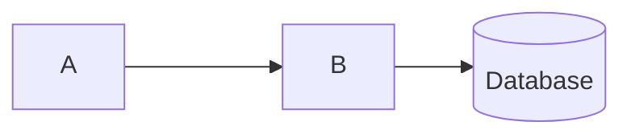

# Common Ground

## Background
This project was a team project built during the 2025 Conestoga Hackathon.

## Purpose / Problem
The world experiences 

## Main Product Challenges
our product in the first itterstion was overly complex, and therfore...

```C++
std::cout << "Hello world" << std::endl
```

## Architecture

