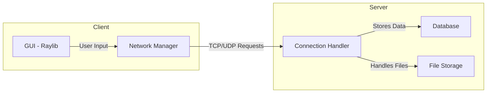

# Open Mind

### Built With

[![C]][C-url] [![C++][C++]][C++-url] [![Raylib][Raylib]][Raylib-url]

### Top contributors:
<a href="https://github.com/Nathancecixx/OpenMind/graphs/contributors">
  
</a>

## Background
This project was a team project built during the 2025 Conestoga Computing Society Hackathon. 


## Purpose / Problem
All around the world people experience hate and descrimination based on the labels placed on them for a subset of their beliefs. If you agree with anything a particular political group says, you then get looked at as a crazy radical for that group. Our messenging service provides an easy platform for people to discuss their beleifs in a civilized way. The goal is to show people how much common ground people actually have in their beliefs and to not villianize the other side.

## Main Product Challenges
our product in the first itterstion was overly complex, and therfore...

```C++
std::cout << "Hello world" << std::endl
```

## Architecture



[C]: https://img.shields.io/badge/C-00599C?style=for-the-badge&logo=c&logoColor=white  
[C-url]: https://en.wikipedia.org/wiki/C_(programming_language)

[C++]: https://img.shields.io/badge/C++-00599C?style=for-the-badge&logo=c%2B%2B&logoColor=white  
[C++-url]: https://isocpp.org/

[Raylib]: https://img.shields.io/badge/Raylib-000000?style=for-the-badge&logo=raylib&logoColor=white  
[Raylib-url]: https://www.raylib.com/
