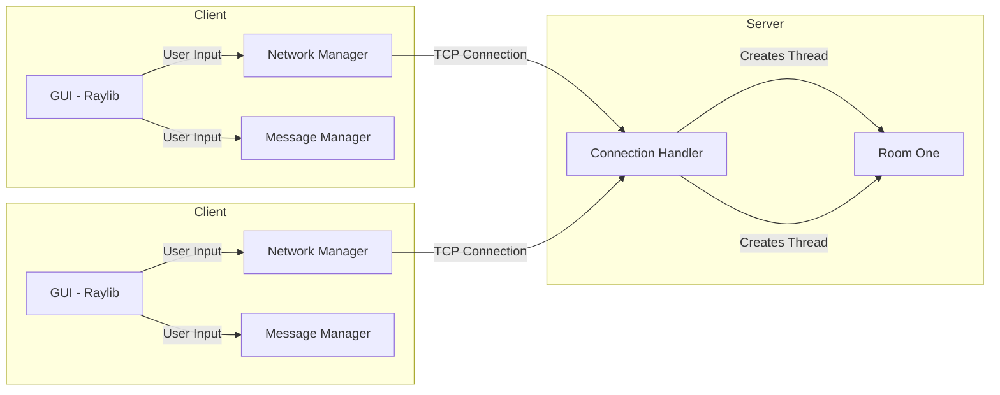

# Open Mind

### Built With

[![C]][C-url] [![C++][C++]][C++-url] [![Raylib][Raylib]][Raylib-url]

### Top contributors:

## Demo

## Background
This project was a team project built during the 2025 Conestoga Computing Society Hackathon. We were tasked with implementing a technical solution to the United Nations **Sustainable Development Goal** #16; Peace, Justice, and Strong Institutions.

👉 Learn more about **SDG** [#16: Peace, Justice, and Strong Institutions](https://sdgs.un.org/goals/goal16)

## Purpose / Problem
Hate and division thrive in silence. When people stop talking, misunderstandings grow, and conflicts escalate. In today's polarized world, individuals are often judged based on labels rather than their actual beliefs. This division fuels hostility, making it harder to see the good in each other.

Open Mind is built to change that. By providing a space for open and respectful discussions, we aim to break down barriers, challenge misconceptions, and push for common ground. Our platform encourages civil conversations that help people recognize shared values rather than focusing solely on differences. Through dialogue, we can replace hostility with understanding, move past labels, and work toward a more united world.

## Features
- **Graphical UI** built with Raylib
- **Real-time messaging** using TCP/IP
- **Custom prompts** to lead conversations to middleground
- **Threaded server architecture** for scalability
- **Secure and private** chat environment

## Architecture
Open Mind follows a client-server architecture where users interact with a Raylib-based GUI. The Network Manager handles communication between the client and server via TCP/IP requests. The server manages multiple discussion rooms, each running on a separate thread.

## License
This project is licensed under the MIT License - see the [LICENSE](LICENSE) file for details.

[C]: https://img.shields.io/badge/C-00599C?style=for-the-badge&logo=c&logoColor=white  
[C-url]: https://en.wikipedia.org/wiki/C_(programming_language)

[C++]: https://img.shields.io/badge/C++-00599C?style=for-the-badge&logo=c%2B%2B&logoColor=white  
[C++-url]: https://isocpp.org/

[Raylib]: https://img.shields.io/badge/Raylib-000000?style=for-the-badge&logo=raylib&logoColor=white  
[Raylib-url]: https://www.raylib.com/
